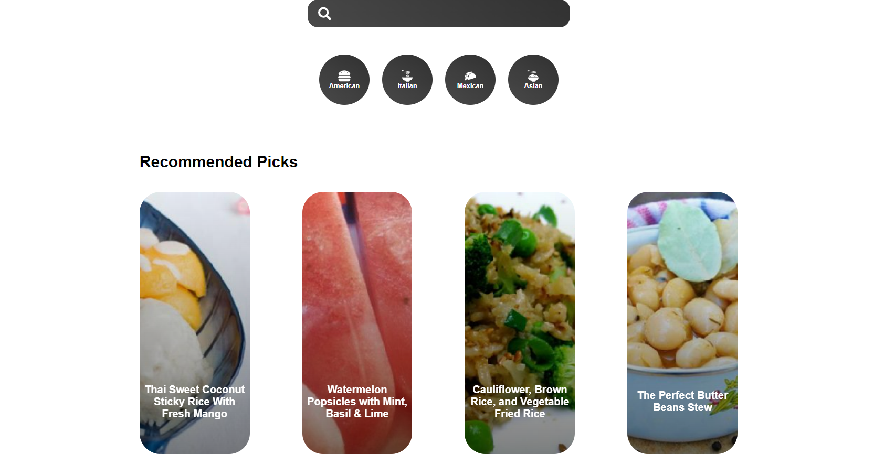
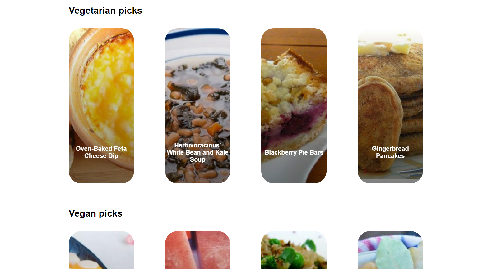

This is a recipe app where the user can search up food in the search bar, choose betweem four cuisines (American, Italian, Mexican, Asian), and choose foods with different dietary restrictions. Once you click on a certain dish, the app will provide instructions on how to make the dish as well as the ingredients needed to make the dish. In order to run this website, the spoonacular API was used (which has a limit of 150 requests per day for free).

Here's how the app looks like: 

## Available Scripts

In the project directory, you can run:

### `npm start`

Runs the app in the development mode.\
Open [http://localhost:3000](http://localhost:3000) to view it in your browser.

The page will reload when you make changes.\
You may also see any lint errors in the console.

### Deployment

This section has moved here: [https://facebook.github.io/create-react-app/docs/deployment](https://facebook.github.io/create-react-app/docs/deployment)

